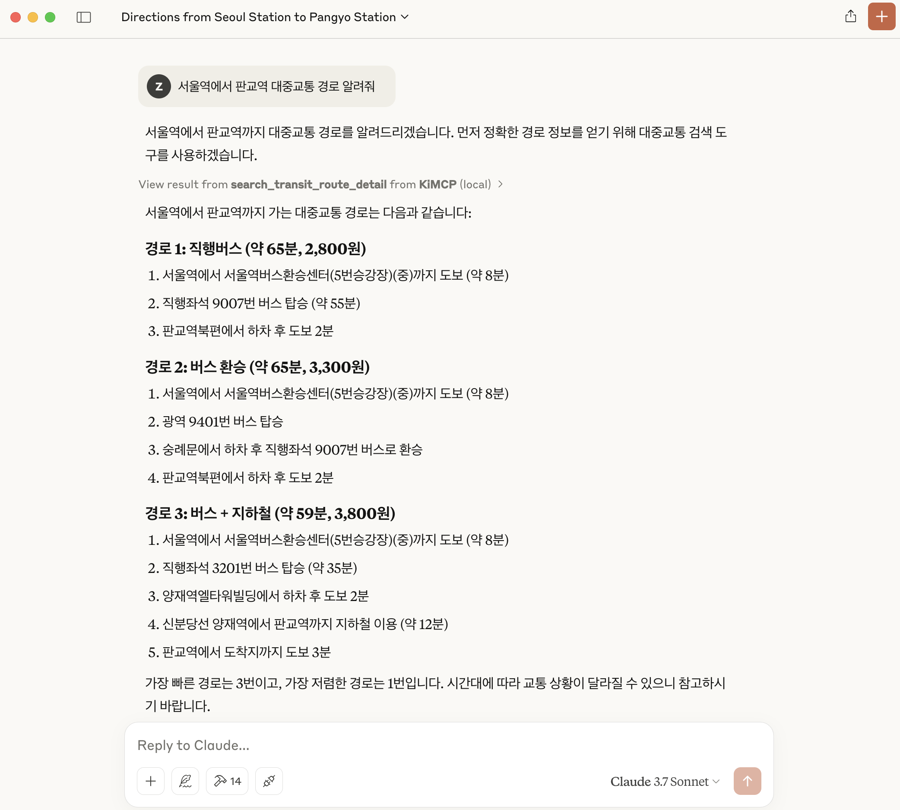

# KiMCP (Korea-integrated Model Context Protocol)


[](https://opensource.org/licenses/MIT)

<p align="center">
  <a href="README.en.md">🇺🇸 English</a> |
  <a href="README.md">🇰🇷 한국어</a>
</p>

KiMCP is a [Model Context Protocol (MCP)](https://modelcontextprotocol.io/introduction) server that enables the use of Korean APIs—such as [Naver](http://www.naver.com/), [Kakao](https://www.kakaocorp.com/), and [TMAP](https://www.tmapmobility.com/)—in LLM applications.

<p align="center" style="display: flex; align-items: center; justify-content: center; gap: 10px;">
  
  
</p>

## Features

- **Naver Blog Search**: Search and retrieve blog content from Naver
- **Naver News Search**: Search for news articles from Naver
- **Naver Cafe Search**: Find articles from Naver Cafe communities
- **Naver Knowledge iN Search**: Search Q&A articles from Naver Knowledge iN
- **Naver Local Search**: Find information about local businesses and places
- **Naver Image Search**: Search for images on Naver
- **Naver Shopping Search**: Find products and compare prices on Naver Shopping
- **Daum Blog Search**: Search and retrieve blog content from Daum
- **Daum Cafe Search**: Find articles from Daum Cafe communities
- **Kakao Map Search**: Search for places and business information on Kakao Map
- **Car Navigation**: Provide car navigation information using Kakao Map

More features in development...

## Prerequisites

- [Claude Desktop](https://claude.ai/download)
- [uv](https://docs.astral.sh/uv/getting-started/installation/) (Python Package Manager)
- [Naver API Key](https://developers.naver.com/apps/#/register)
- [Kakao API Key](https://developers.kakao.com/console/app)

## Installation

1. **Clone the repository**

   ```bash
   git clone https://github.com/zeikar/kimcp
   cd kimcp
   ```

2. **Install dependencies**

   ```bash
   uv sync
   ```

3. **Set up environment variables**

   Create a `.env` file in the project root by referencing the provided `.env.example` file:

   ```bash
   # Copy the .env.example file to .env
   cp .env.example .env

   # Edit the created .env file
   vi .env   # Or use your preferred text editor
   ```

   Enter your API keys in the `.env` file as follows:

   ```
   NAVER_CLIENT_ID=your_naver_client_id
   NAVER_CLIENT_SECRET=your_naver_client_secret
   KAKAO_REST_API_KEY=your_kakao_rest_api_key
   ```

   > **Note**:
   >
   > - You can obtain Naver API keys from the [Naver Developer Center](https://developers.naver.com/apps/#/register).
   > - You can obtain Kakao API keys from [Kakao Developers](https://developers.kakao.com/console/app).
   > - If you only need to use certain APIs, you only need to set up the corresponding API keys.
   >   - MCP tools will be automatically disabled if their API keys are not provided. For example, if you only provide Naver API keys and not Kakao API keys, only Naver-related tools will be available.

4. **Install to Claude Desktop**

   ```bash
   uv run mcp install main.py -f .env
   ```

5. **Restart Claude Desktop** to apply changes

## Development

Run the MCP inspector for testing and development:

```bash
uv run mcp dev main.py
```

## Roadmap

- ✅ Naver API integration
- ✅ Kakao API integration
- ⬜ SK Open API integration
- ⬜ Korea Meteorological Administration (KMA) integration
- And more...

## License

This project is licensed under the MIT License. See the [LICENSE](LICENSE) file for details.

## Acknowledgements

- [py-mcp-naver](https://github.com/pfldy2850/py-mcp-naver)
- [MCP Python SDK](https://github.com/modelcontextprotocol/python-sdk)
- [Claude Desktop](https://claude.ai/download)
- [Naver Developers](https://developers.naver.com/main)
- [Kakao Developers](https://developers.kakao.com/)
