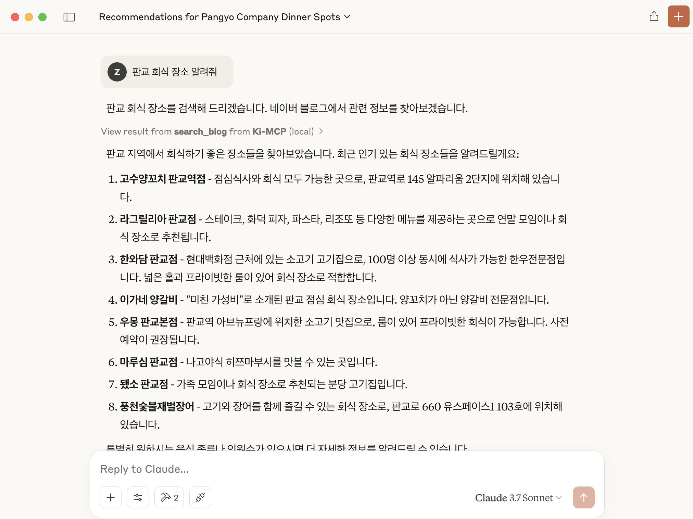

# KiMCP (Korea-integrated Model Context Protocol)


[](https://opensource.org/licenses/MIT)

<p align="center">
  <a href="README.en.md">🇺🇸 English</a> |
  <a href="README.md">🇰🇷 한국어</a>
</p>

KiMCP는 [Model Context Protocol (MCP)](https://modelcontextprotocol.io/introduction)를 활용하여 [네이버](http://www.naver.com/), [카카오](https://www.kakaocorp.com/)와 같은 한국 API들을 LLM 애플리케이션에서 사용할 수 있는 MCP 서버입니다.



## Features

- **네이버 블로그 검색**: 네이버에서 블로그 콘텐츠 검색
  - **네이버 블로그 글 상세 보기**: 블로그 글의 상세 내용을 가져옴
- **네이버 뉴스 검색**: 네이버에서 뉴스 기사 검색
- **네이버 카페 검색**: 네이버 카페 커뮤니티에서 게시물 검색
- **네이버 지식iN 검색**: 네이버 지식iN에서 Q&A 게시물 검색
- **네이버 지역 검색**: 지역 업체 및 장소 정보 검색
- **네이버 이미지 검색**: 네이버에서 이미지 검색
- **네이버 쇼핑 검색**: 네이버 쇼핑에서 상품 검색 및 가격 비교
- **다음 블로그 검색**: 다음 블로그에서 블로그 콘텐츠 검색
- **다음 카페 검색**: 다음 카페에서 게시물 검색
- 현재 개발 중...

## Prerequisites

- [Claude Desktop](https://claude.ai/download)
- [uv](https://docs.astral.sh/uv/getting-started/installation/) (Python 패키지 관리자)
- [네이버 API Key](https://developers.naver.com/apps/#/register)
- [카카오 API Key](https://developers.kakao.com/console/app)

## Installation

1. **저장소 복제**

   ```bash
   git clone https://github.com/zeikar/kimcp
   cd kimcp
   ```

2. **Python 의존성 설치**

   ```bash
   uv sync
   ```

3. **환경 변수 설정**

   프로젝트 루트에 제공된 `.env.example` 파일을 참고하여 `.env` 파일을 생성하세요:

   ```bash
   # .env.example 파일을 .env로 복사
   cp .env.example .env

   # 생성된 .env 파일 편집
   vi .env   # 또는 원하는 텍스트 에디터 사용
   ```

   `.env` 파일에 다음과 같이 API 키를 입력하세요:

   ```
   NAVER_CLIENT_ID=your_naver_client_id
   NAVER_CLIENT_SECRET=your_naver_client_secret
   KAKAO_REST_API_KEY=your_kakao_rest_api_key
   ```

   > **참고**:
   >
   > - 네이버 API 키는 [네이버 개발자 센터](https://developers.naver.com/apps/#/register)에서 발급 받을 수 있습니다.
   > - 카카오 API 키는 [카카오 Developers](https://developers.kakao.com/console/app)에서 발급 받을 수 있습니다.
   > - 필요한 API만 사용하는 경우, 해당 API 키만 설정해도 됩니다.
   >   - API 키를 입력하지 않으면 해당 MCP 도구가 자동으로 비활성화됩니다. 예를 들어, 네이버 API 키만 입력하고 카카오 API 키를 입력하지 않으면 네이버 관련 도구만 사용 가능합니다.

4. **Claude Desktop에 설치**

   ```bash
   uv run mcp install main.py -f .env
   ```

5. **변경 사항을 적용하려면 Claude Desktop 재시작**

## Development

테스트 및 개발을 위한 MCP inspector 실행:

```bash
uv run mcp dev main.py
```

## Roadmap

- ✅ 네이버 API 통합
- ✅ 카카오 API 통합
- ⬜ 기상청(KMA) 통합
- 기타 등등

## License

이 프로젝트는 MIT 라이센스를 따릅니다. 자세한 내용은 [LICENSE](LICENSE) 파일을 참조하세요.

## Acknowledgements

- [py-mcp-naver](https://github.com/pfldy2850/py-mcp-naver)
- [MCP](https://modelcontextprotocol.io/introduction)
- [MCP Python SDK](https://github.com/modelcontextprotocol/python-sdk)
- [네이버 개발자 센터](https://developers.naver.com/main)
- [카카오 Developers](https://developers.kakao.com/)
- [Claude Desktop](https://claude.ai/download)
